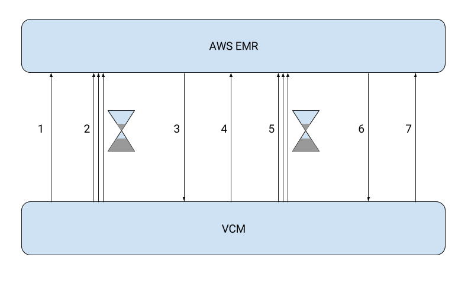
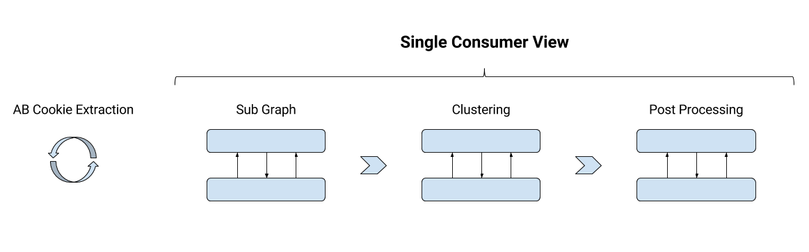

- title : Automate SCV
- theme : night
- transition : default

***

### SCV is very manual

- We want to automate it

***

### AWS EMR

- Automatic High Capacity Spark Cluster

***

### VCM

- Job Running Infrastructure

***

***

***

### Cookie Sync Extraction

s3://adbrain-prod/cookiesync/pn-cid

***

### Cookie Sync Extraction

s3://adbrain-prod/cookiesync/ab-cid

***

### Sub Graph Step

Still Manual :-(

***

### Clustering Step

Still Manual :-(

***

### Post Processing Step

Much Less Manual :-)

***

### Post Processing Step

- meta data
- cookie match lookup
- capping
- output formatting

***

### Post Processing Step

- compiled to .jar
- still not successfully tested

***

### Sparkling VCM squad

- built some bridges

***

### Rivers to Cross

- passing json data
- running a production scale job

***

### Learning

- Faster Feedback
